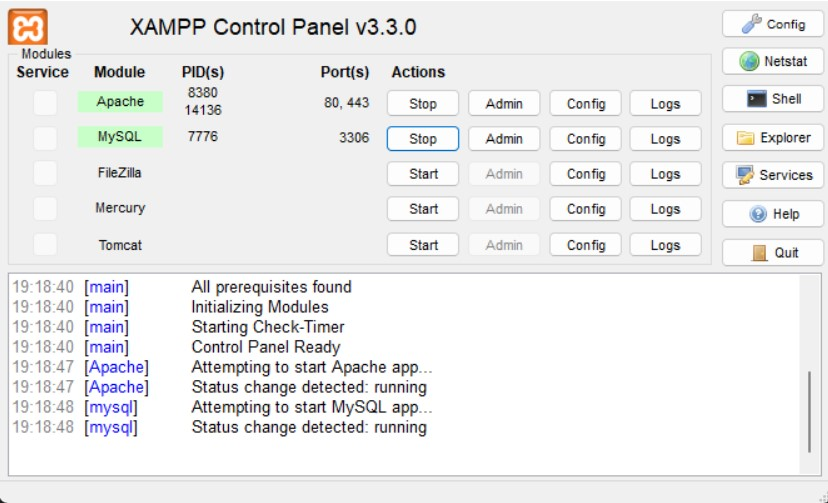
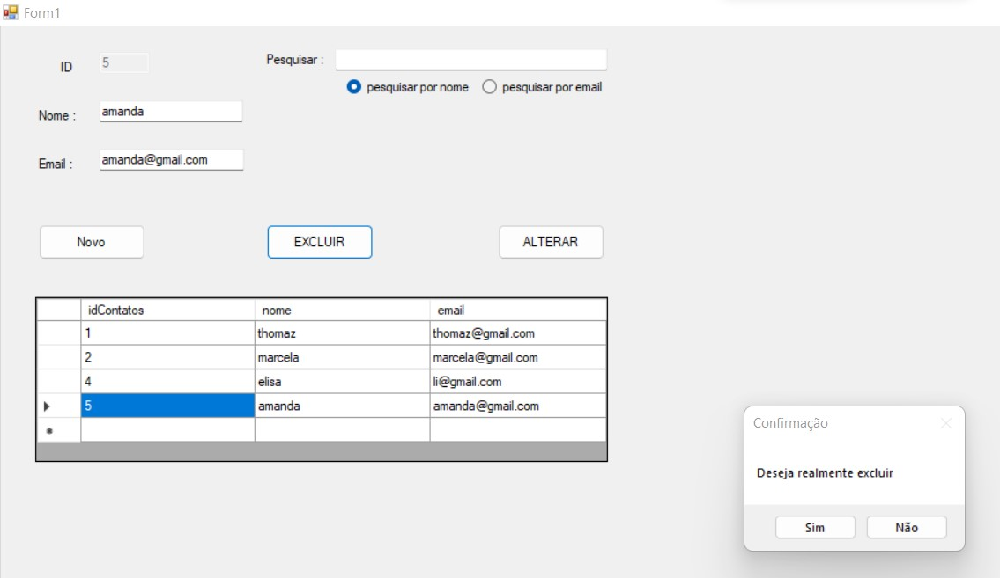
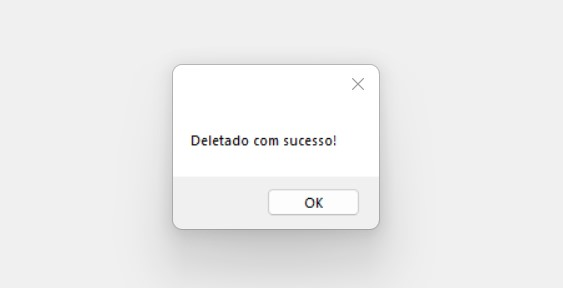
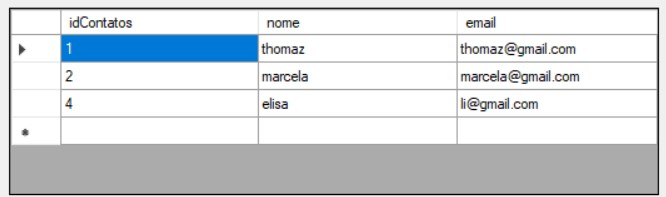
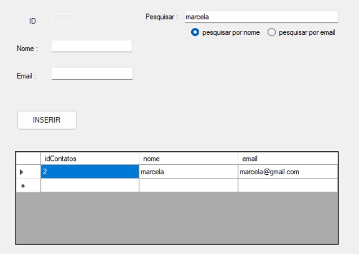
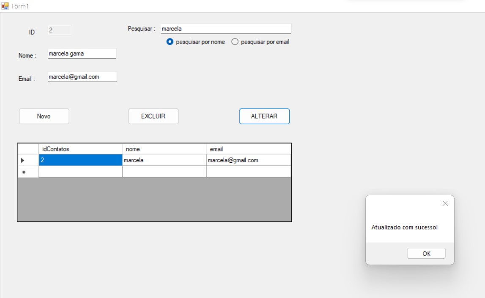
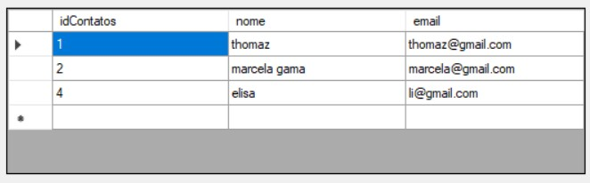

# Agenda feita em C# no Visual Studio

## Primeiro iniciamos o MySQL no nosso computador pelo XAMPP

<h2 align="center">
  
</h2>

### Deletando um usuário
- selecionar o nome
<h2 align="center">
  
</h2>

- mensagem de confirmação
<h2 align="center">
  
</h2>

- após deletar
<h2 align="center">
  
</h2>

### Pesquisa por nome

- inserindo o nome na barra de pesquisa
<h2 align="center">
  
</h2>

- atualizando o nome pesquisado
<h2 align="center">
  
</h2>

- nome atualizado
<h2 align="center">
  
</h2>